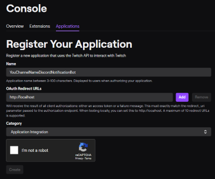
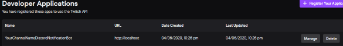
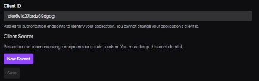
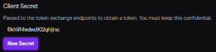

# Twitch Discord Notification Bot

This is a simple Windows Service bot which will updated discord webhooks with messages when streams go online. This bot is downloaded and run on your local computer or on a Virtual Machine. It is compatible with Windows 7 and newer.

The bot can be run as either a windows console app or as a Windows Service. When run as a windows service, it will automatically start and run in the background when your computer boots.

## Quickstart

1. Download the `TwitchDiscordNotificationBot.zip` [latest release](https://github.com/markekraus/TwitchDiscordNotificationBot/releases/latest)
1. Extract it to `c:\TwitchDiscordNotificationBot`
1. [Register a Twitch App](#register-an-application-with-twitch) and get the client ID and client secret.
1. [Create a Discord Webhook](https://support.discordapp.com/hc/en-us/articles/228383668-Intro-to-Webhooks) and note the URI
1. Run the `configtool.exe`
1. choose `2` to configure bot settings
1. choose `1`, enter the Twitch Client ID, and press any key
1. choose `2`, enter the twitch client secret, and press any key
1. choose `3`, enter the Discord Webhook URI, and press any key
1. choose `13` to go back to the main menu
1. choose `3` to manage channels then return to the main menu
1. choose `1` from the main menu to configure the service
1. choose `2` to register the service
1. choose `4` to start the service

## Building

The best way to build and publish this project is with PowerShell and `Invoke-Build`.

```PowerShell
Invoke-Build ./build.ps1 -Task Clean
Invoke-Build ./build.ps1 -Task Restore
Invoke-Build ./build.ps1 -Task Build
Invoke-Build ./build.ps1 -Task Publish
```

## Configuration

You can configure the bot by using the `configtool.exe` binary or by manually updating the `appsettings.json` file.

### Using configtool.exe

**NOTE:** Always run the `configtool.exe` as an administrator with elevation.

With the config tool you can manage the service or modify the bot configuration.

```text
Main Menu
---
1. Register/Unregister/Start/Stop/Disable Bot Service
2. Configure Bot Settings
3. Manage Twitch Channels
4. Exit Configtool
Choose an option:
```

### JSON Configuration

Example `appsettings.json`:

```json
{
    "TwitchApiClientId": "jlalshlha8y2ohlquw87y2891y9ohyab",
    "TwitchApiClientSecret": "khkahgs79692kba9769kh4980bnwb",
    "TwitchApiCheckIntervalSeconds": 60,
    "TwitchChannels": [
        {
            "Channel": "markekraus",
            "Message": "{username} is streaming \"{game}\" at {url}"
        },
        {
            "Channel": "rocksinmydryer",
            "Message": "{username} is streaming \"{game}\" at {url}"
        }
    ],
    "DiscordWebHookUri": " https://discordapp.com/api/webhooks/86538269681578396285/rcpRkbajgi8k-908790jkghg878tvg-i7tVjvjgvJYTSj",
    "EnableConsoleLogging": false,
    "EnableFileLogging": false,
    "SkipActiveStreamsOnStartup": true
}
```

### TwitchApiClientId

This is a string containing the Client ID configured for the app in [dev.twitch.tv](https://dev.twitch.tv/console/apps).
See "[Register an Application with Twitch](#register-an-application-with-twitch)" for how to register an application.

### TwitchApiClientSecret

This is a string containing the Client Secret configured for the app in [dev.twitch.tv](https://dev.twitch.tv/console/apps).
See "[Register an Application with Twitch](#register-an-application-with-twitch)" for how to register an application.

### TwitchApiCheckIntervalSeconds

This is the interval in seconds that the Twitch API will be queried for stream status updates.

### TwitchChannels

This is an array of objects configuring the channels which will be monitored.

* `Channel` is the channel name (e.g. `markekraus`)
* Message is the message to display in chat.

```json
        {
            "Channel": "markekraus",
            "Message": "{username} is streaming \"{game}\" at {url}"
        }
```

See "[Message Formatting](#message-formatting)" for details on how to format messages.

### DiscordWebHookUri

The Webhook URI for discord.
See "[Intro to Webhooks](https://support.discordapp.com/hc/en-us/articles/228383668-Intro-to-Webhooks)" to learn how to create a discord webhook.

### EnableConsoleLogging

This enables logging output to the console.
This is useful for development or troubleshooting.
**Warning**: This will log secrets to the console.

### EnableFileLogging

This enables logging output to a file.
The file will be located in the `Logs` folder and will have a filename like `TwitchDiscordNotificationBot-20200403.txt`.
This is useful for development or troubleshooting.
**Warning**: This will log secrets to the file.

### SkipActiveStreamsOnStartup

This setting enables skipping notifications for active streams when the bot starts.
`false` will turn on notifications for already in progress streams when the bot starts.
`true` will turn off notifications for already in progress streams when the bot starts and only new online notifications will be sent.

## Register an Application with Twitch

1. Go to [https://dev.twitch.tv/dashboard/apps/create](https://dev.twitch.tv/dashboard/apps/create).
1. You may need to complete the initial developer setup and agreements.
1. In the "Name" field enter `YourChannelNameDiscordNotificationBot` where `YourChannelName` is the name of your channel.
1. In the "OAuth Redirect URLs" field enter `http://localhost`
1. In the "Category" select "Application Integration"
1. Complete any CAPTCHA requirements.
1. Click create

   

1. On the [Apps listing](https://dev.twitch.tv/console/apps) click the "Manage" button next to your new app registration.

   

1. Note the Client ID for the `TwitchApiClientId` setting in `appsettings.json`

   

1. Click the "New Secret" button
1. Click OK when asked if you want to create a new secret.
1. Note the new secret for the `TwitchApiClientSecret` setting in `appsettings.json`. **This secret will only be available right after it is created.**

   

1. Complete any CAPTCHA requirements.
1. Click the save button.

## Message Formatting

The `Message` setting Supports the following variables:

* `{username}` - The Display name for the user which includes their preferred capitalization.
* `{channel}` - The raw channel name without capitalization.
* `{url}` - The URL to the twitch channel.
* `{game}` - The name of the game or category.
* `{gameBoxArtUrl}` - The URL to the box art of the game or category.
* `{streamLanguage}` - The language the stream is in.
* `{type}` - The type of stream (will always be 'live')
* `{title}` - The title the stream has set for the stream.
* `{viewerCount}` - The number of viewers when the stream went online. Unless it is a really popular channel this will likely be 0-2. This does not update automatically.
* `{startTime}` - The time the stream started.

You can at-mention users and roles, but not in the way you normally would in discord.
You need to [enable developer mode](https://discordia.me/en/developer-mode) in discord and use it to get the user or role ID.
In the message you need to reference it like this: `<@446264438287368192>`.
See "[Discord Markdown](https://birdie0.github.io/discord-webhooks-guide/other/discord_markdown.html)" for more info.
Note that `\` in messages needs to be escaped like `\\`.

```json
        {
            "Channel": "markekraus",
            "Message": "Hey <@&696142812948987984> {username} (<@446264438287368192>) is streaming \"{game}\" at {url}"
        }
```

In my discord, the message would appear as:

```text
Hey @members markekraus (@markekraus) is streaming at https://twitch.tv/markekraus
```
